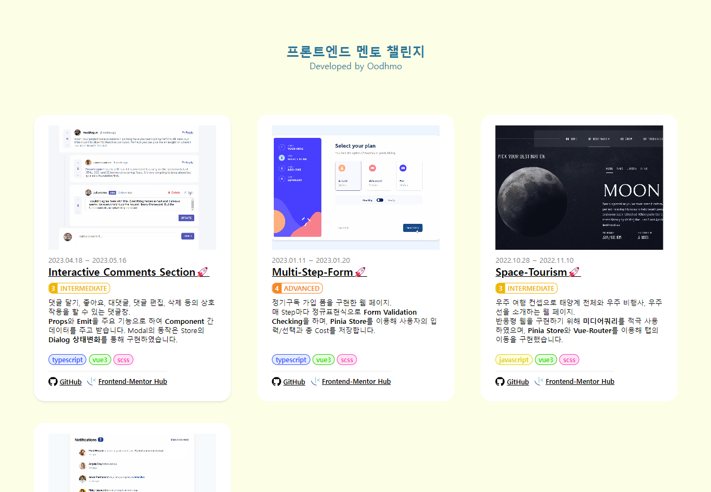

## Frontend Mentor Challenges

https://oodhmo.github.io/Frontend-Mentor-Challenges/🚀

참여했던 프론트엔드 멘토 챌린지를 정리한 페이지입니다.
  

> 프론트엔드 멘토 챌린지: 개발자들이 실제 웹 페이지 디자인을 구현하며 실력을 키울 수 있도록 다양한 프론트엔드 과제를 제공하는 플랫폼

  

| 제목  | 기술 스택 | github |
|:----------:|:----------:|:----------:|
|  Notification Page   |    | https://github.com/oodhmo/Notification-Page |
| Space-Tourism    |       |   https://github.com/oodhmo/Space-Tourism  |
| Multi-Step-Form |    | https://github.com/oodhmo/Space-Tourism
| Interactive Comments Section |    | https://github.com/oodhmo/Interactive-comment-section|